# Complete Execution Flow: `make benchmark-mcp-tools` with `RUST_MCP_MODE=full`

## Overview

This document describes the complete request flow when running the MCP tools benchmark with full Rust runtime mode enabled.

---

## Architecture Diagram

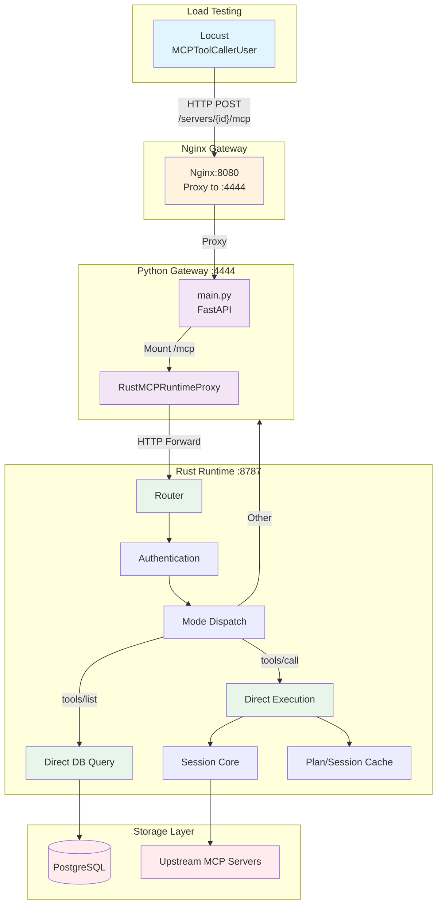
```mermaid
flowchart TB
    subgraph Client["Load Testing"]
        L[Locust<br/>MCPToolCallerUser]
    end

    subgraph Gateway["Nginx Gateway"]
        N[Nginx:8080<br/>Proxy to :4444]
    end

    subgraph Python["Python Gateway :4444"]
        PM[main.py<br/>FastAPI]
        RP[RustMCPRuntimeProxy]
    end

    subgraph Rust["Rust Runtime :8787"]
        RR[Router]
        AUTH[Authentication]
        DISPATCH[Mode Dispatch]
        DB[Direct DB Query]
        EXEC[Direct Execution]
        SESSION[Session Core]
        CACHE[Plan/Session Cache]
    end

    subgraph Storage["Storage Layer"]
        PG[(PostgreSQL)]
        UPS[Upstream MCP Servers]
    end

    L -->|"HTTP POST<br/>/servers/{id}/mcp"| N
    N -->|Proxy| PM
    PM -->|Mount /mcp| RP
    RP -->|HTTP Forward| RR
    RR --> AUTH
    AUTH --> DISPATCH
    
    DISPATCH -->|"tools/list"| DB
    DISPATCH -->|"tools/call"| EXEC
    DISPATCH -->|Other| Python
    
    DB --> PG
    EXEC --> CACHE
    EXEC --> SESSION
    SESSION --> UPS
    
    style L fill:#e1f5ff
    style N fill:#fff3e0
    style PM fill:#f3e5f5
    style RP fill:#f3e5f5
    style RR fill:#e8f5e9
    style DB fill:#e8f5e9
    style EXEC fill:#e8f5e9
    style PG fill:#ffebee
    style UPS fill:#ffebee
```

---

## Phase 1: Benchmark Invocation (Locust)

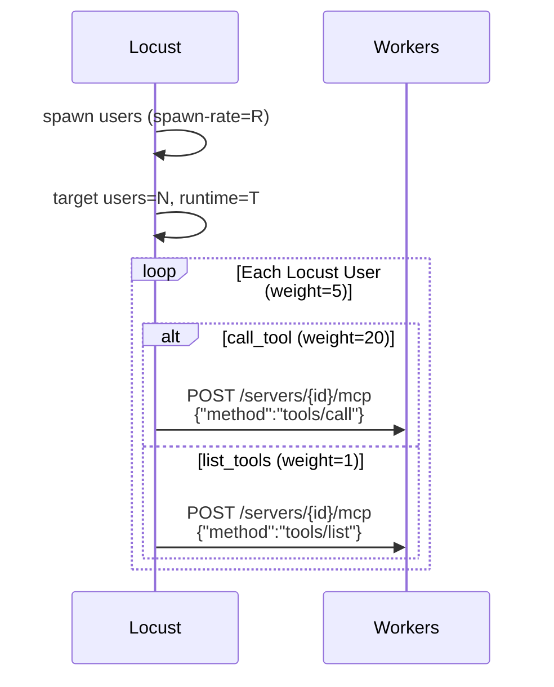
```mermaid
sequenceDiagram
    participant L as Locust
    participant W as Workers
    
    L->>L: spawn users (spawn-rate=R)
    L->>L: target users=N, runtime=T
    
    loop Each Locust User (weight=5)
        alt call_tool (weight=20)
            L->>W: POST /servers/{id}/mcp<br/>{"method":"tools/call"}
        else list_tools (weight=1)
            L->>W: POST /servers/{id}/mcp<br/>{"method":"tools/list"}
        end
    end
```

**Locust Configuration:**
- **User Class:** `MCPToolCallerUser`
- **Weight:** 5
- **Tasks:**
  - `call_tool` (weight 20): POST `/servers/{server_id}/mcp` with `{"jsonrpc":"2.0","method":"tools/call",...}`
  - `list_tools` (weight 1): POST `/servers/{server_id}/mcp` with `{"jsonrpc":"2.0","method":"tools/list"}`

---

## Phase 2: Nginx Gateway (Port 8080)

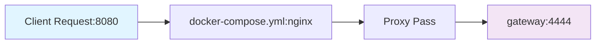
```mermaid
flowchart LR
    A[Client Request:8080] --> B[docker-compose.yml:nginx]
    B --> C[Proxy Pass]
    C --> D[gateway:4444]
    
    style A fill:#e1f5ff
    style D fill:#f3e5f5
```

---

## Phase 3: Python Gateway - Initial Routing

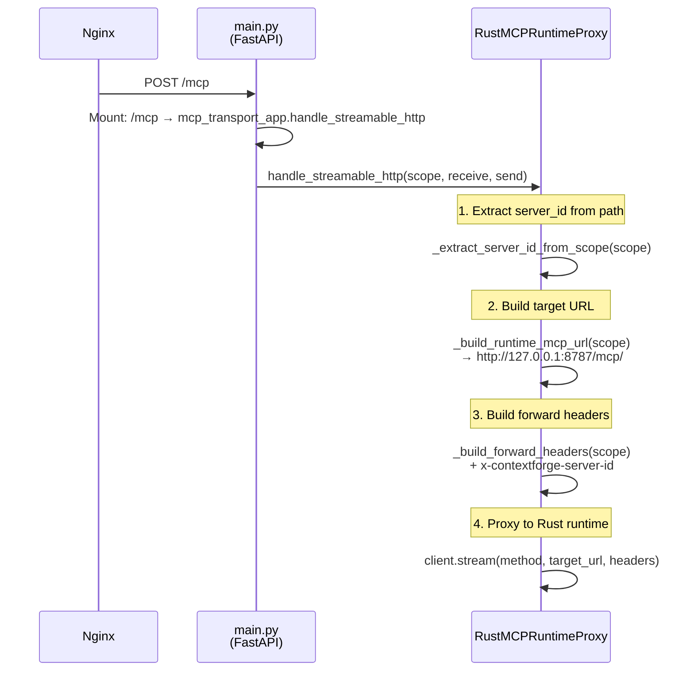
```mermaid
sequenceDiagram
    participant N as Nginx
    participant M as main.py<br/>(FastAPI)
    participant P as RustMCPRuntimeProxy
    
    N->>M: POST /mcp
    M->>M: Mount: /mcp → mcp_transport_app.handle_streamable_http
    
    M->>P: handle_streamable_http(scope, receive, send)
    
    Note over P: 1. Extract server_id from path
    P->>P: _extract_server_id_from_scope(scope)
    
    Note over P: 2. Build target URL
    P->>P: _build_runtime_mcp_url(scope)<br/>→ http://127.0.0.1:8787/mcp/
    
    Note over P: 3. Build forward headers
    P->>P: _build_forward_headers(scope)<br/>+ x-contextforge-server-id
    
    Note over P: 4. Proxy to Rust runtime
    P->>P: client.stream(method, target_url, headers)
```

**Key Files:**
- `mcpgateway/main.py`: `app.mount("/mcp", app=mcp_transport_app.handle_streamable_http)`
- `mcpgateway/transports/rust_mcp_runtime_proxy.py`: `RustMCPRuntimeProxy.handle_streamable_http`

---

## Phase 4: Rust Runtime Entry Point

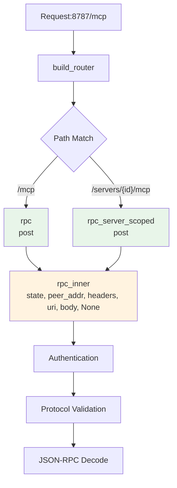
```mermaid
flowchart TD
    A["Request:8787/mcp"] --> B["build_router"]
    B --> C{"Path Match"}

    C -->|"/mcp"| D["rpc<br/>post"]
    C -->|"/servers/{id}/mcp"| E["rpc_server_scoped<br/>post"]

    D --> F["rpc_inner<br/>state, peer_addr, headers, uri, body, None"]
    E --> F

    F --> G["Authentication"]
    G --> H["Protocol Validation"]
    H --> I["JSON-RPC Decode"]

    style D fill:#e8f5e9
    style E fill:#e8f5e9
    style F fill:#fff3e0
```

**Router Configuration:**
```rust
pub fn build_router(state: AppState) -> Router {
    Router::new()
        .route("/mcp", post(rpc))
        .route("/servers/{server_id}/mcp", post(rpc_server_scoped))
}
```

---

## Phase 5: Authentication & Request Decoding

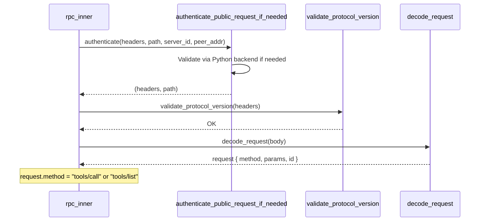
```mermaid
sequenceDiagram
    participant R as rpc_inner
    participant A as authenticate_public_request_if_needed
    participant V as validate_protocol_version
    participant D as decode_request
    
    R->>A: authenticate(headers, path, server_id, peer_addr)
    A->>A: Validate via Python backend if needed
    A-->>R: (headers, path)
    
    R->>V: validate_protocol_version(headers)
    V-->>R: OK
    
    R->>D: decode_request(body)
    D-->>R: request { method, params, id }
    
    Note over R: request.method = "tools/call" or "tools/list"
```

---

## Phase 6: Mode-Specific Routing (RUST_MCP_MODE=full)

### Configuration

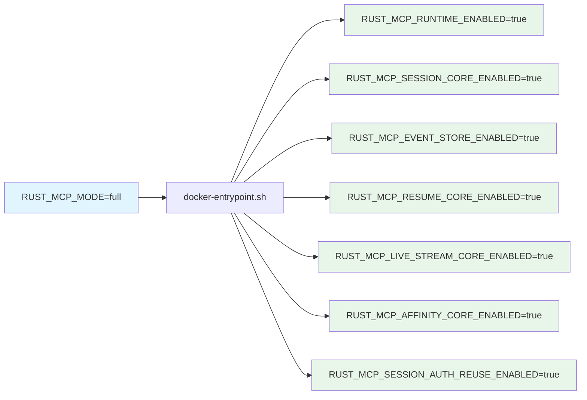
```mermaid
flowchart LR
    A[RUST_MCP_MODE=full] --> B[docker-entrypoint.sh]
    
    B --> C1[RUST_MCP_RUNTIME_ENABLED=true]
    B --> C2[RUST_MCP_SESSION_CORE_ENABLED=true]
    B --> C3[RUST_MCP_EVENT_STORE_ENABLED=true]
    B --> C4[RUST_MCP_RESUME_CORE_ENABLED=true]
    B --> C5[RUST_MCP_LIVE_STREAM_CORE_ENABLED=true]
    B --> C6[RUST_MCP_AFFINITY_CORE_ENABLED=true]
    B --> C7[RUST_MCP_SESSION_AUTH_REUSE_ENABLED=true]
    
    style A fill:#e1f5ff
    style C1 fill:#e8f5e9
    style C2 fill:#e8f5e9
    style C3 fill:#e8f5e9
    style C4 fill:#e8f5e9
    style C5 fill:#e8f5e9
    style C6 fill:#e8f5e9
    style C7 fill:#e8f5e9
```

### Request Dispatch Logic

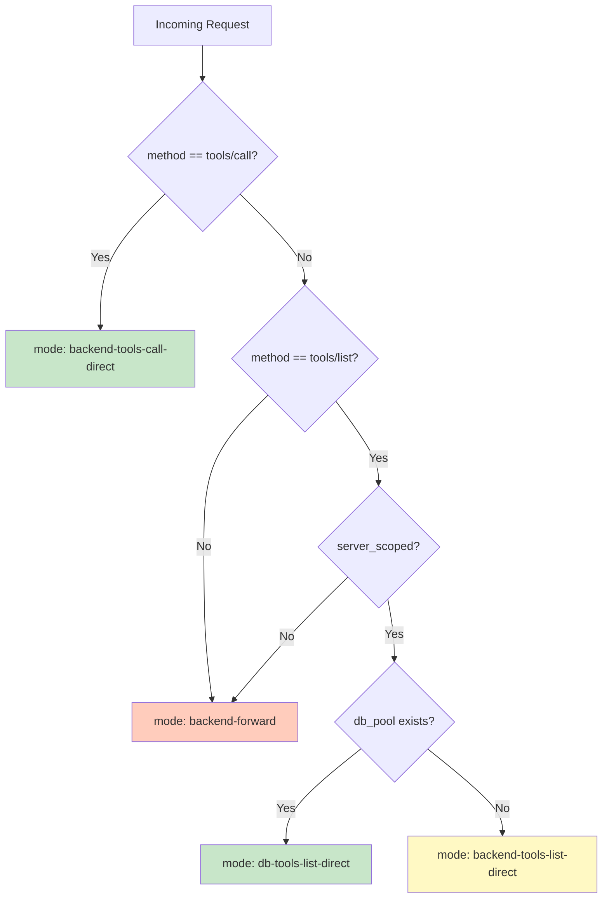
```mermaid
flowchart TD
    A[Incoming Request] --> B{method == tools/call?}
    B -->|Yes| C[mode: backend-tools-call-direct]
    B -->|No| D{method == tools/list?}
    
    D -->|No| E[mode: backend-forward]
    D -->|Yes| F{server_scoped?}
    
    F -->|No| E
    F -->|Yes| G{db_pool exists?}
    
    G -->|Yes| H[mode: db-tools-list-direct]
    G -->|No| I[mode: backend-tools-list-direct]
    
    style C fill:#c8e6c9
    style H fill:#c8e6c9
    style I fill:#fff9c4
    style E fill:#ffccbc
```

---

## Phase 7A: tools/list Execution Path

### Path Selection Diagram

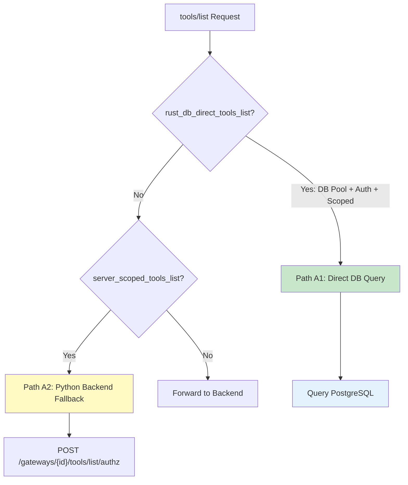
```mermaid
flowchart TD
    A["tools/list Request"] --> B{"rust_db_direct_tools_list?"}

    B -->|"Yes: DB Pool + Auth + Scoped"| C["Path A1: Direct DB Query"]
    B -->|"No"| D{"server_scoped_tools_list?"}

    D -->|"Yes"| E["Path A2: Python Backend Fallback"]
    D -->|"No"| F["Forward to Backend"]

    C --> G["Query PostgreSQL"]
    E --> H["POST /gateways/{id}/tools/list/authz"]

    style C fill:#c8e6c9
    style G fill:#e3f2fd
    style E fill:#fff9c4
```

### Path A1: Direct DB Query (Fast Path)

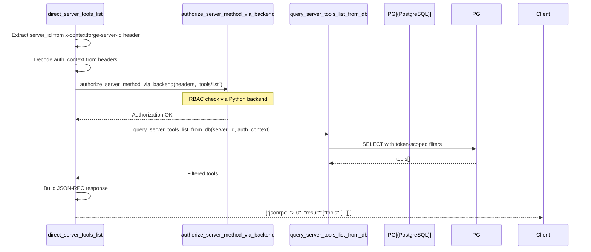
```mermaid
sequenceDiagram
    participant R as direct_server_tools_list
    participant A as authorize_server_method_via_backend
    participant Q as query_server_tools_list_from_db
    participant PG[(PostgreSQL)]
    
    R->>R: Extract server_id from x-contextforge-server-id header
    R->>R: Decode auth_context from headers
    
    R->>A: authorize_server_method_via_backend(headers, "tools/list")
    Note over A: RBAC check via Python backend
    A-->>R: Authorization OK
    
    R->>Q: query_server_tools_list_from_db(server_id, auth_context)
    
    Q->>PG: SELECT with token-scoped filters
    PG-->>Q: tools[]
    Q-->>R: Filtered tools
    
    R->>R: Build JSON-RPC response
    R-->>Client: {"jsonrpc":"2.0", "result":{"tools":[...]}}
```

**SQL Query (Token-Scoped):**
```sql
SELECT t.name, t.description, t.input_schema, t.output_schema, t.annotations
FROM tools t
JOIN server_tool_association sta ON t.id = sta.tool_id
WHERE sta.server_id = $1
  AND t.enabled = TRUE
  AND (
    t.visibility = 'public'
    OR (t.owner_email = $2)                    -- Owner access
    OR (t.team_id = ANY($3) AND t.visibility IN ('team', 'public'))  -- Team access
  )
```

### Path A2: Python Backend Fallback

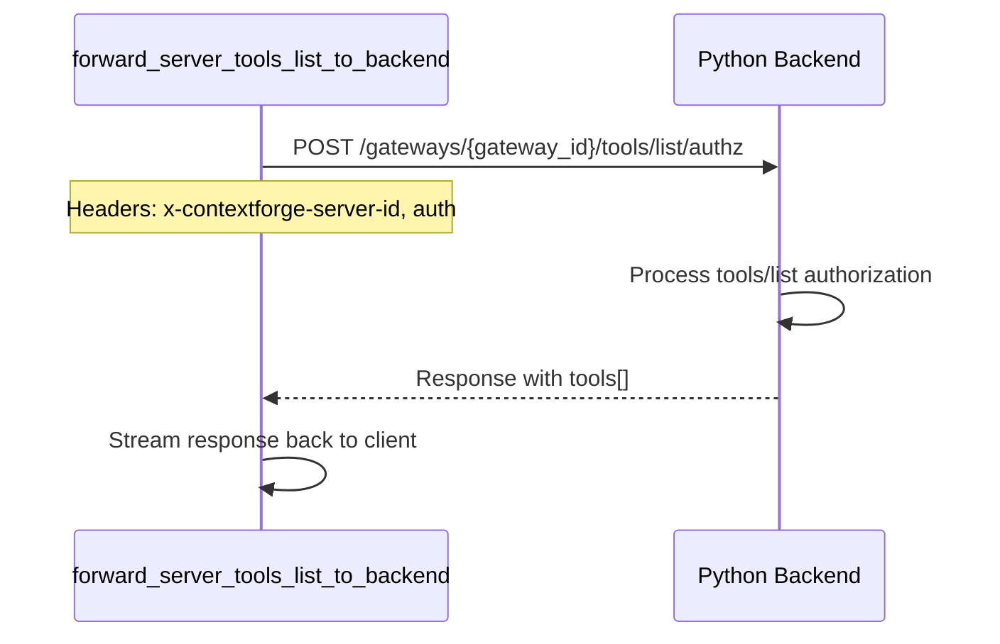
```mermaid
sequenceDiagram
    participant R as forward_server_tools_list_to_backend
    participant P as Python Backend
    
    R->>P: POST /gateways/{gateway_id}/tools/list/authz
    Note over R: Headers: x-contextforge-server-id, auth
    
    P->>P: Process tools/list authorization
    P-->>R: Response with tools[]
    
    R->>R: Stream response back to client
```

---

## Phase 7B: tools/call Execution Path (Main Fast Path)

### Overview

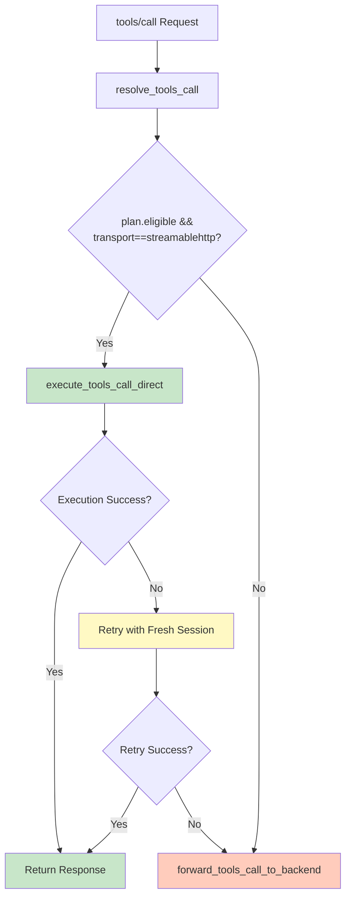
```mermaid
flowchart TD
    A[tools/call Request] --> B[resolve_tools_call]
    
    B --> C{plan.eligible &&<br/>transport==streamablehttp?}
    
    C -->|Yes| D[execute_tools_call_direct]
    C -->|No| E[forward_tools_call_to_backend]
    
    D --> F{Execution Success?}
    F -->|Yes| G[Return Response]
    F -->|No| H[Retry with Fresh Session]
    
    H --> I{Retry Success?}
    I -->|Yes| G
    I -->|No| E
    
    style D fill:#c8e6c9
    style G fill:#c8e6c9
    style E fill:#ffccbc
    style H fill:#fff9c4
```

### Step 1: Plan Resolution (Cached)

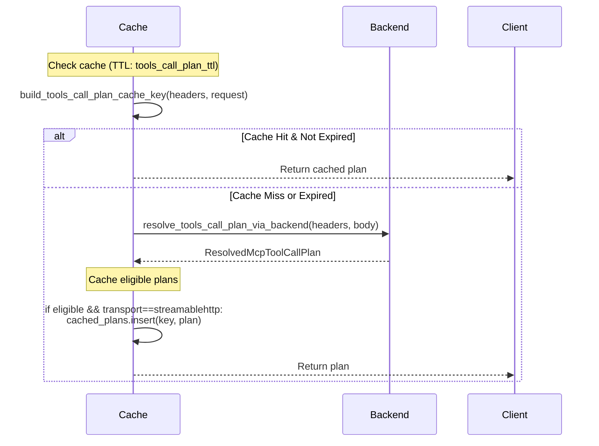
```mermaid
sequenceDiagram
    participant C as Cache
    participant B as Backend
    
    Note over C: Check cache (TTL: tools_call_plan_ttl)
    C->>C: build_tools_call_plan_cache_key(headers, request)
    
    alt Cache Hit & Not Expired
        C-->>Client: Return cached plan
    else Cache Miss or Expired
        C->>B: resolve_tools_call_plan_via_backend(headers, body)
        B-->>C: ResolvedMcpToolCallPlan
        
        Note over C: Cache eligible plans
        C->>C: if eligible && transport==streamablehttp:<br/>cached_plans.insert(key, plan)
        
        C-->>Client: Return plan
    end
```

**Resolved Plan Structure:**
```rust
struct ResolvedMcpToolCallPlan {
    eligible: bool,                    // Can Rust execute directly?
    transport: Option<String>,         // "streamablehttp" | "sse" | "stdio"
    server_url: Option<String>,        // Target MCP server URL
    remote_tool_name: Option<String>,  // Tool name at upstream
    timeout_ms: Option<u64>,
    fallback_reason: Option<String>,   // Why fallback was chosen
}
```

### Step 2: Direct Execution

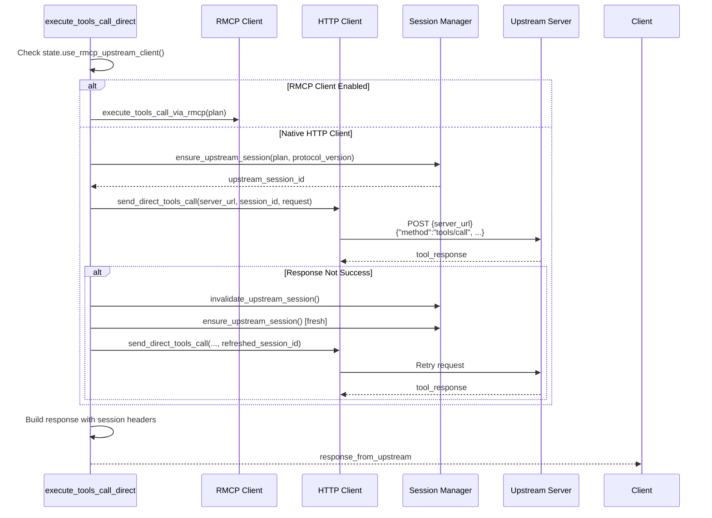
```mermaid
sequenceDiagram
    participant E as execute_tools_call_direct
    participant R as RMCP Client
    participant H as HTTP Client
    participant S as Session Manager
    participant U as Upstream Server
    
    E->>E: Check state.use_rmcp_upstream_client()
    
    alt RMCP Client Enabled
        E->>R: execute_tools_call_via_rmcp(plan)
    else Native HTTP Client
        E->>S: ensure_upstream_session(plan, protocol_version)
        S-->>E: upstream_session_id
        
        E->>H: send_direct_tools_call(server_url, session_id, request)
        H->>U: POST {server_url}<br/>{"method":"tools/call", ...}
        U-->>H: tool_response
        
        alt Response Not Success
            E->>S: invalidate_upstream_session()
            E->>S: ensure_upstream_session() [fresh]
            E->>H: send_direct_tools_call(..., refreshed_session_id)
            H->>U: Retry request
            U-->>H: tool_response
        end
    end
    
    E->>E: Build response with session headers
    E-->>Client: response_from_upstream
```

### Step 3: Upstream Session Management

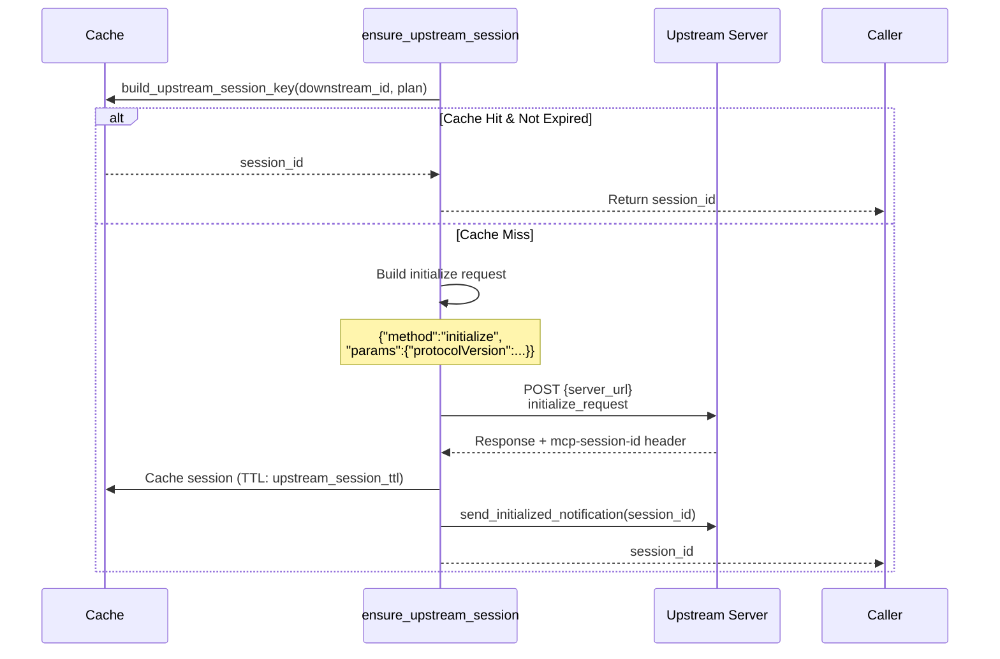
```mermaid
sequenceDiagram
    participant C as Cache
    participant S as ensure_upstream_session
    participant U as Upstream Server
    
    S->>C: build_upstream_session_key(downstream_id, plan)
    
    alt Cache Hit & Not Expired
        C-->>S: session_id
        S-->>Caller: Return session_id
    else Cache Miss
        S->>S: Build initialize request
        Note over S: {"method":"initialize",<br/>"params":{"protocolVersion":...}}
        
        S->>U: POST {server_url}<br/>initialize_request
        U-->>S: Response + mcp-session-id header
        
        S->>C: Cache session (TTL: upstream_session_ttl)
        S->>U: send_initialized_notification(session_id)
        
        S-->>Caller: session_id
    end
```

---

## Phase 8: Session Core Features (RUST_MCP_MODE=full only)

### Session Affinity

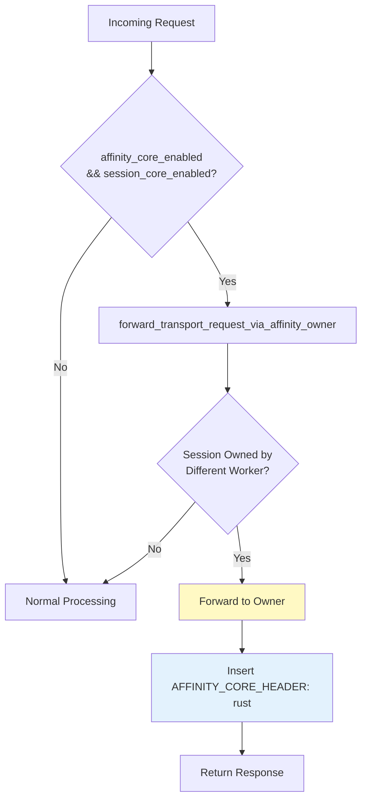
```mermaid
flowchart TD
    A[Incoming Request] --> B{affinity_core_enabled<br/>&& session_core_enabled?}
    
    B -->|No| C[Normal Processing]
    B -->|Yes| D[forward_transport_request_via_affinity_owner]
    
    D --> E{Session Owned by<br/>Different Worker?}
    E -->|Yes| F[Forward to Owner]
    E -->|No| C
    
    F --> G[Insert AFFINITY_CORE_HEADER: rust]
    G --> H[Return Response]
    
    style F fill:#fff9c4
    style G fill:#e3f2fd
```

### Session Auth Reuse

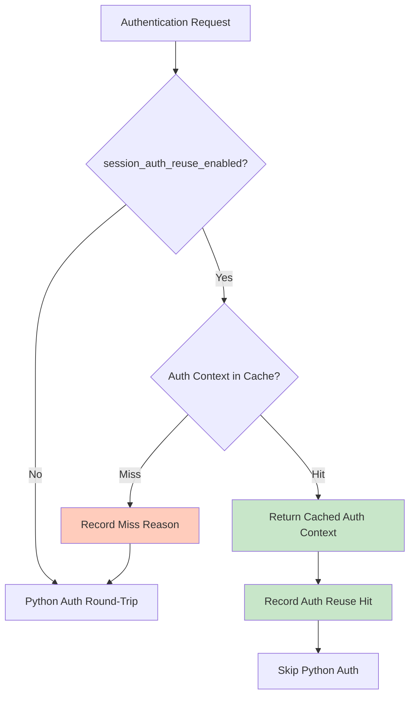
```mermaid
flowchart TD
    A[Authentication Request] --> B{session_auth_reuse_enabled?}
    
    B -->|No| C[Python Auth Round-Trip]
    B -->|Yes| D{Auth Context in Cache?}
    
    D -->|Hit| E[Return Cached Auth Context]
    D -->|Miss| F[Record Miss Reason]
    F --> C
    
    E --> G[Record Auth Reuse Hit]
    G --> H[Skip Python Auth]
    
    style E fill:#c8e6c9
    style G fill:#c8e6c9
    style F fill:#ffccbc
```

### Event Store (Resumable Sessions)

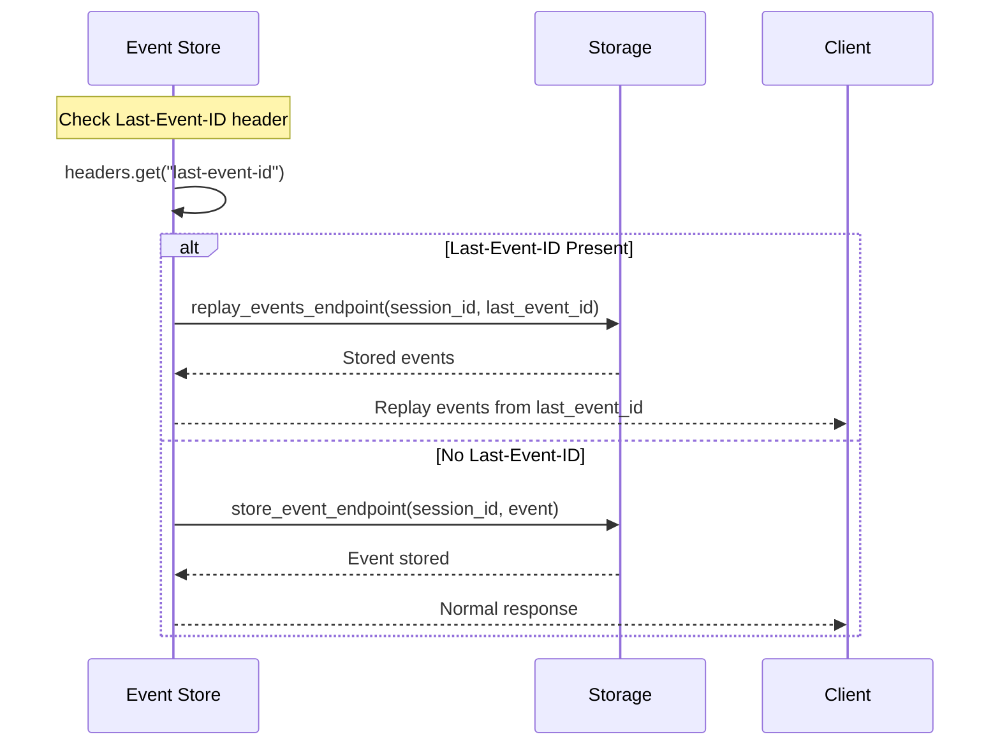
```mermaid
sequenceDiagram
    participant E as Event Store
    participant S as Storage
    
    Note over E: Check Last-Event-ID header
    E->>E: headers.get("last-event-id")
    
    alt Last-Event-ID Present
        E->>S: replay_events_endpoint(session_id, last_event_id)
        S-->>E: Stored events
        E-->>Client: Replay events from last_event_id
    else No Last-Event-ID
        E->>S: store_event_endpoint(session_id, event)
        S-->>E: Event stored
        E-->>Client: Normal response
    end
```

---

## Phase 9: Response Path

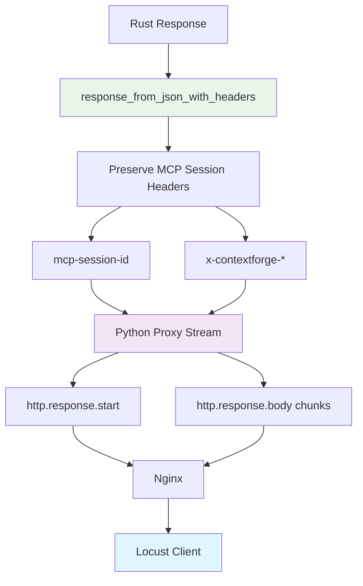
```mermaid
flowchart TD
    A[Rust Response] --> B[response_from_json_with_headers]
    
    B --> C[Preserve MCP Session Headers]
    C --> D[mcp-session-id]
    C --> E[x-contextforge-*]
    
    D --> F[Python Proxy Stream]
    E --> F
    
    F --> G[http.response.start]
    F --> H[http.response.body chunks]
    
    G --> I[Nginx]
    H --> I
    
    I --> J[Locust Client]
    
    style B fill:#e8f5e9
    style F fill:#f3e5f5
    style J fill:#e1f5ff
```

**Response Streaming (Python):**
```python
async with client.stream(...) as response:
    await send({
        "type": "http.response.start",
        "status": response.status_code,
        ...
    })
    async for chunk in response.aiter_bytes():
        await send({
            "type": "http.response.body",
            "body": chunk,
            ...
        })
```

---

## Logic Branches Summary

| Request Method | RUST_MCP_MODE=full Path | Fallback Conditions |
|----------------|------------------------|---------------------|
| `tools/list` (server-scoped) | Direct DB query | No DB pool, missing auth context, DB error |
| `tools/list` (non-scoped) | Python backend | Always |
| `tools/call` (streamable-http) | Direct execution via cached plan | Plan not eligible, transport≠streamable-http, execution error |
| `tools/call` (other transport) | Python backend | SSE, stdio, or other transports |
| `initialize` | Session core (if enabled) | Session core disabled |
| `resources/list`, `prompts/list` | Direct DB query | No DB pool, missing auth |
| `resources/read`, `prompts/get` | Direct DB query | Complex params, no DB pool |
| Notifications | Direct backend forward | Always |

---

## Key Performance Optimizations in `full` Mode

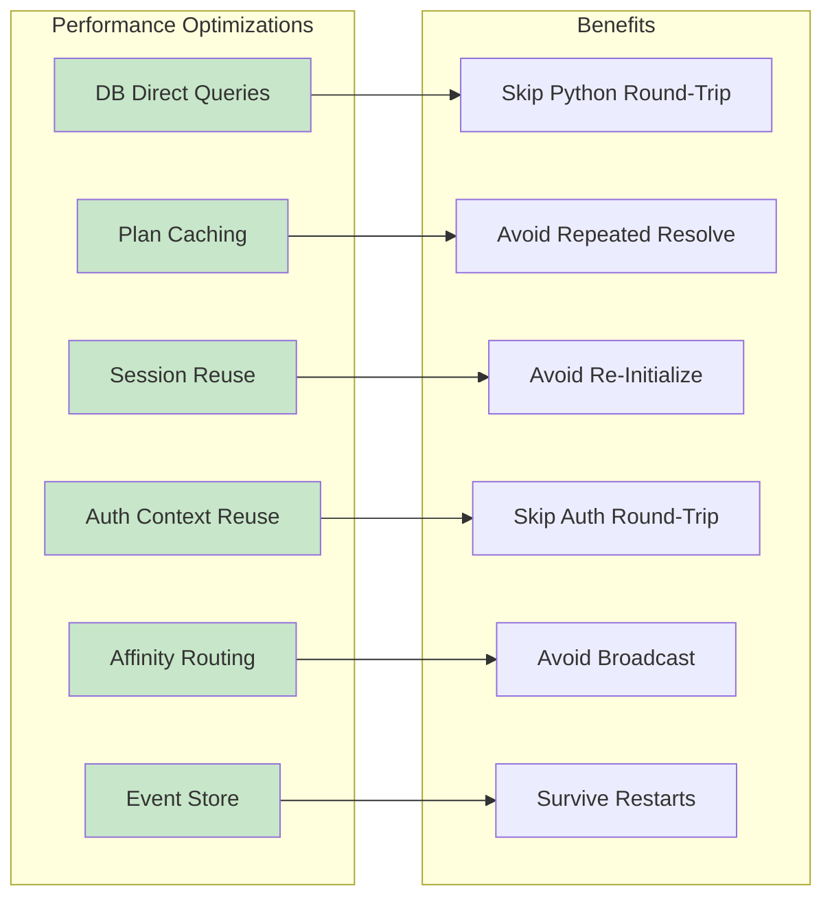
```mermaid
flowchart LR
    subgraph Optimizations["Performance Optimizations"]
        O1[DB Direct Queries]
        O2[Plan Caching]
        O3[Session Reuse]
        O4[Auth Context Reuse]
        O5[Affinity Routing]
        O6[Event Store]
    end
    
    subgraph Benefits["Benefits"]
        B1[Skip Python Round-Trip]
        B2[Avoid Repeated Resolve]
        B3[Avoid Re-Initialize]
        B4[Skip Auth Round-Trip]
        B5[Avoid Broadcast]
        B6[Survive Restarts]
    end
    
    O1 --> B1
    O2 --> B2
    O3 --> B3
    O4 --> B4
    O5 --> B5
    O6 --> B6
    
    style O1 fill:#c8e6c9
    style O2 fill:#c8e6c9
    style O3 fill:#c8e6c9
    style O4 fill:#c8e6c9
    style O5 fill:#c8e6c9
    style O6 fill:#c8e6c9
```

### Detailed Optimizations

1. **DB Direct Queries**
   - Skip Python for `tools/list`, `resources/list`, `prompts/list`
   - Direct PostgreSQL access with token-scoped filters

2. **Plan Caching**
   - Cache resolved `tools/call` plans
   - TTL: `tools_call_plan_ttl`
   - Avoids repeated resolve requests to Python backend

3. **Session Reuse**
   - Cache upstream MCP sessions
   - TTL: `upstream_session_ttl`
   - Avoid re-initialize overhead

4. **Auth Context Reuse**
   - Cache auth context per session
   - Skip Python auth round-trip
   - Tracked via `session_auth_reuse_hit/miss` metrics

5. **Affinity Routing**
   - Direct session-owner forwarding
   - Avoid broadcast to all workers
   - Header: `AFFINITY_CORE_HEADER: rust`

6. **Event Store**
   - Persist session state for resume
   - Survive worker restarts
   - `Last-Event-ID` header for replay

---

## Complete End-to-End Flow

```mermaid
flowchart TB
    subgraph Client["Client Layer"]
        L[Locust Benchmark]
    end
    
    subgraph Edge["Edge Layer"]
        N[Nginx:8080]
    end
    
    subgraph Gateway["Gateway Layer"]
        PM[Python FastAPI :4444]
        RP[RustMCPRuntimeProxy]
    end
    
    subgraph Runtime["Rust Runtime :8787"]
        AUTH[Authentication]
        DISPATCH{Dispatch}
        
        subgraph FastPath["Fast Paths"]
            DB[Direct DB Query]
            CACHE[Plan Cache]
            EXEC[Direct Execution]
            SESSION[Session Cache]
        end
        
        subgraph CoreFeatures["Core Features"]
            AFF[Affinity]
            REUSE[Auth Reuse]
            EVT[Event Store]
        end
    end
    
    subgraph Backend["Backend Layer"]
        PY[Python Backend]
        PG[(PostgreSQL)]
        MCP[Upstream MCP Servers]
    end
    
    L --> N
    N --> PM
    PM --> RP
    RP --> AUTH
    AUTH --> DISPATCH
    
    DISPATCH -->|"tools/list"| DB
    DISPATCH -->|"tools/call"| CACHE
    DISPATCH -->|Other| PY
    
    DB --> PG
    CACHE --> EXEC
    EXEC --> SESSION
    SESSION --> MCP
    
    DISPATCH -.Fallback.-> PY
    EXEC -.Error.-> PY
    
    AFF -.Session Routing.-> EXEC
    REUSE -.Auth Skip.-> AUTH
    EVT -.Persistence.-> SESSION
    
    style L fill:#e1f5ff
    style N fill:#fff3e0
    style PM fill:#f3e5f5
    style RP fill:#f3e5f5
    style AUTH fill:#e8f5e9
    style DB fill:#c8e6c9
    style CACHE fill:#c8e6c9
    style EXEC fill:#c8e6c9
    style SESSION fill:#c8e6c9
    style PG fill:#ffebee
    style MCP fill:#ffebee
    style PY fill:#ffccbc
```
